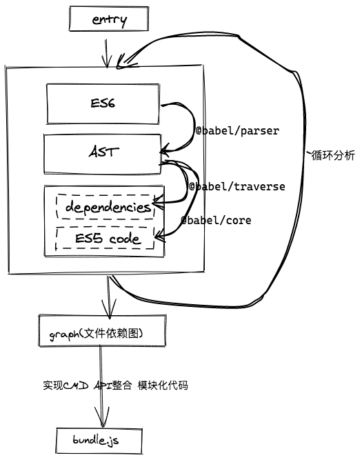

# easy_webpack

#### 介绍
基于@babel/core @babel/parser @babel/traverse @babel/preset-env实现简易webpack

#### 模块
- @babel/parser - 将ES6语法抽象成AST
- @babel/traverse - 抓取AST依赖，并收集
- @babel/core - 用于将AS转化成commonJS
- @babel/preset-env - babel配置集

#### 思路
